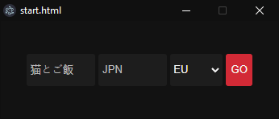
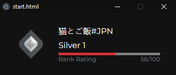

# Valorant Stream Overlay

  

An app that can be used for showing your current rank status on stream

# Usage
- Put your name in the name input
- Put your tag in the tag input
- Pick your region (AP = Asia Pacific | BR = Brazil | EU = Europe | KR = Korea | LATAM = Latin America | NA = North America)

# Errors
- When no rank image appears and it says null/100: You picked the wrong region
- If it gives you the error message "something went wrong": 
  - Open your console with (crtl + shift + i)
  - Error 429: Too many tries
  - Error 404: Name or tag is wrong

 psoi on discord if any other problems appear

 # Images

# Thanks
[HenrikDev](https://github.com/Henrik-3/unofficial-valorant-api) for his API
